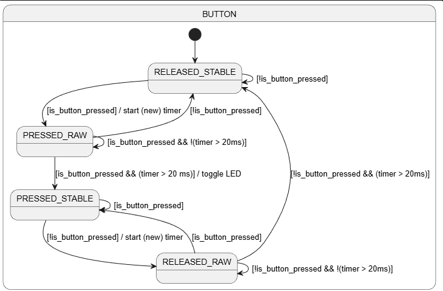

# STM32 Button Debouncing

A small project to showcase the implementation of a debounced button in a non-blocking way with the help of a model of a Finite State Machine (FSM).


Project focus:
- state machine modelling
- non-blocking timing logic
- button debouncing
- deterministic event handling
- translating UML model into C code

## Project Goal
A mechanical push button generates unstable electrical signals, which can lead to undesirable behaviour. In order to prevent those signals, a mechanism called "debouncing" is used. It can be implemented with additional hardware, but software debouncing is common as well. This small project focuses just on the correct implementation of software debouncing.

In order to fulfil that goal the following criteria need to be met:
1. detect only stable button presses
2. ignore unstable transitions
3. toggle an LED exactly once per valid press (turn LED on, if it is off and vice versa)
4. blocking delays are to be avoided

The behaviour was first modeled using a PlantUML state machine before being implemented in C.



The diagram can be found at:
```
Docs/button_debounce_state_diagram.puml
Docs/button_debounce_state_diagram.png
```

## Hardware
- STM32 Nucleo board
- breadboard
- Push button connected to PC2
- LED connected to PC3

## Software Architecture
The application uses:
- cyclic polling
- finite state transitions
- time-based guard
- explicit state handling with switch-case

Other solutions would have been possible, but this project prioritizes readability and understanding of the concepts above.