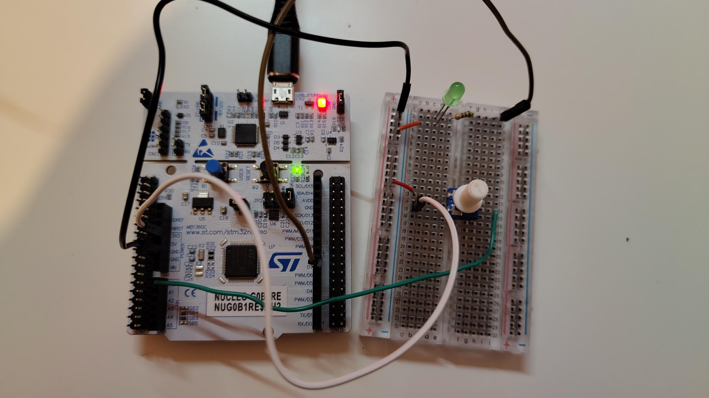
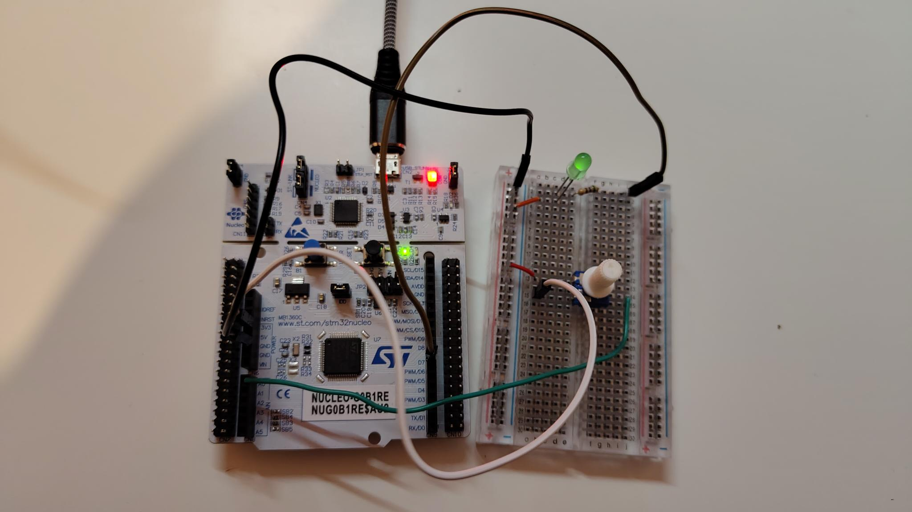
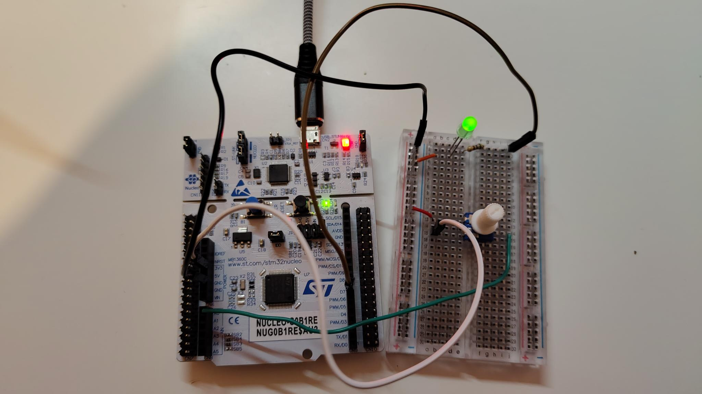
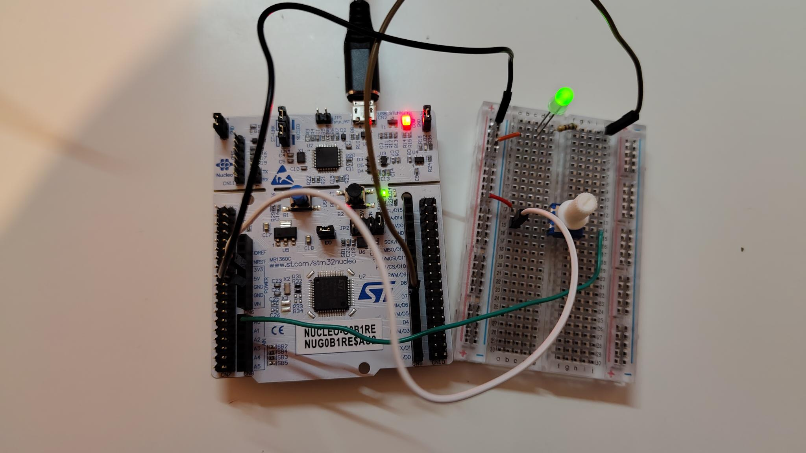

# ADC Controlled PWM LED

This project demonstrates how an analog voltage from a potentiometer can be converted into a PWM duty cycle to control the brightness of an LED.

Project focus:
- ADC configuration and usage
- PWM generation with hardware timers
- analog signal processing
- signal scaling
- threshold handling

## Hardware
- STM32 Nucleo-G0B1RE
- breadboard
- potentiometer connected to ADC1_IN0 (PA0)
- green LED connected to TIM1_CH1 (PA8)
- UART serial connection for debugging

## Notes
In order to be able to turn off the LED completely and reliably, I chose a lower threshold of 500 as ADC input. Such a high lower threshold was chosen to compensate for an ADC offset, likely caused by inexpensive hardware.

## Images
### Potentiometer Position Low

### Potentiometer Position Medium-Low

### Potentiometer Position Medium-High

### Potentiometer Position High
